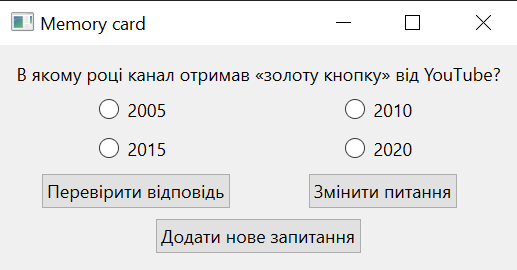
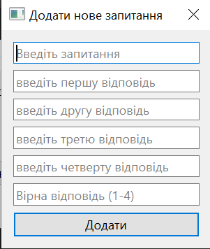

# Сьогодні я хочу розповісти про проект,який ми робили протягом останніх уроків.
***Цей проект - Вікторина,в якій ми запитуємо питання,користувач повинен відповісти на них.***
***Також ти можеш писати свої питання,і змінити його на інше за допомогою кнопки "Змінити питання"***
***В цьому проекті є кнопка "База данних" - В ньому можно подивитися на питання,які ми вводили раніше.***

***В цій вікторині є три кнопки:***
- ***Перевірити відповідь***
- ***Додати нове запитання***
- ***Змінити питання***

***Кнопка "Змінити питання" дає нам можливість змінити запитання на те,яке ми вводили раніше.***

***Якщо натиснути клавішу "Додати нове питання", нам відкриється віно з 6 рядками,в яких нам потрібно ввести питання,варіанти відповідей так правильну відповідь.***